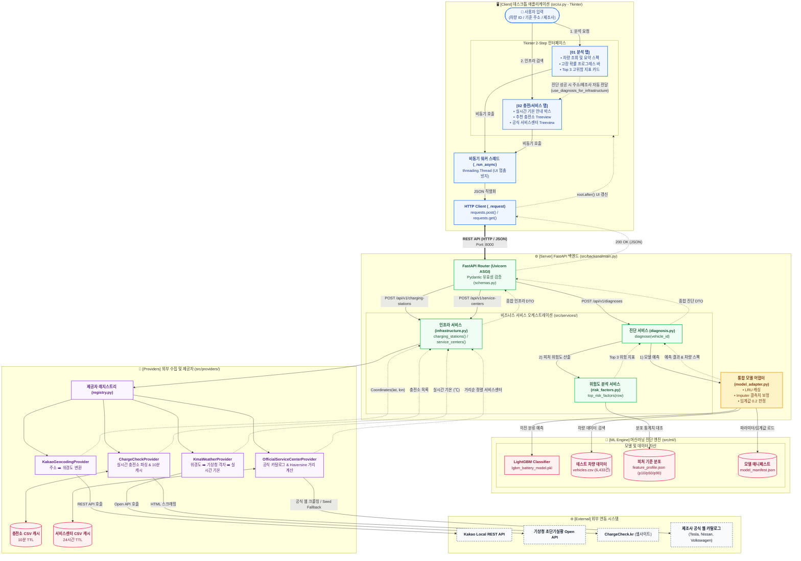

# ⚡ EV Guard 배터리 진단 및 인프라 서비스 아키텍처 & 유기적 연결 명세서

본 문서는 **EV Guard** 시스템의 **데스크톱 클라이언트(UI)**, **FastAPI 백엔드 서버**, **머신러닝 진단 엔진**, **외부 API 및 크롤러**가 **어떻게 유기적으로 데이터를 주고받으며 동작하는지**를 시각적 다이어그램(Mermaid & Visual Box Art)과 함께 정리한 명세서입니다.

---

## 📑 목차
1. [유기적 시스템 연결 구조도 (Mermaid Visual Architecture)](#1-유기적-시스템-연결-구조도-mermaid-visual-architecture)
2. [한눈에 보는 직관적 비주얼 맵 (Visual Box-Arrow Diagram)](#2-한눈에-보는-직관적-비주얼-맵-visual-box-arrow-diagram)
3. [2단계 비즈니스 파이프라인 상세 연결도](#3-2단계-비즈니스-파이프라인-상세-연결도)
4. [레이어별 기술 스택 & 핵심 엔진 명세](#4-레이어별-기술-스택--핵심-엔진-명세)
5. [모듈 및 함수별 입출력 데이터 매핑 일람](#5-모듈-및-함수별-입출력-데이터-매핑-일람)

---

## 1. 유기적 시스템 연결 구조도 (Mermaid Visual Architecture)

> 마크다운 프리뷰로 볼 때 각 모듈 간의 **호출 관계**와 **전달되는 데이터(화살표 텍스트)**가 어떻게 유기적으로 결합되어 있는지 보여줍니다.



---

## 2. 한눈에 보는 직관적 비주얼 맵 (Visual Box-Arrow Diagram)

> 마크다운 뷰어에서 텍스트 블록 형태로 즉시 확인 가능한 **유기적 연결 맵**입니다.

```text
┌──────────────────────────────────────────────────────────────────────────────────────────────────┐
│ [1] CLIENT LAYER (Tkinter Desktop Application)                                                    │
│                                                                                                  │
│   ┌──────────────────────────────┐              ┌────────────────────────────────────────────┐   │
│   │  01 분석 탭                  │              │  02 충전/서비스 탭                         │   │
│   │  - 차량 ID 입력              │              │  - 주소 / 제조사 입력                      │   │
│   │  - 배터리 상태 (정상/이상)   │─────────────►│  - 실시간 기온 (30℃ 기준 완속/급속 추천)  │   │
│   │  - 고장 확률 (%)             │ (진단 완료 시│  - 가까운 추천 충전소 리스트               │   │
│   │  - Top 3 고위험 지표 카드    │  정보 자동전달)│  - 공식 서비스센터 거리순 정렬 목록        │   │
│   └──────────────┬───────────────┘              └─────────────────────┬──────────────────────┘   │
│                  │                                                    │                          │
│                  ▼                                                    ▼                          │
│   ┌──────────────────────────────────────────────────────────────────────────────────────────┐   │
│   │  비동기 워커 엔진 (_run_async) ──► HTTP Requests Client ──► (JSON Payload 전송)           │   │
│   └───────────────────────────────────────────┬──────────────────────────────────────────────┘   │
└───────────────────────────────────────────────┼──────────────────────────────────────────────────┘
                                                │ REST API (HTTP Request / Response)
                                                ▼
┌──────────────────────────────────────────────────────────────────────────────────────────────────┐
│ [2] SERVER LAYER (FastAPI Backend @ http://127.0.0.1:8000)                                       │
│                                                                                                  │
│   ┌──────────────────────────────────────────────────────────────────────────────────────────┐   │
│   │  FastAPI Router (main.py) ──► Pydantic Data Validation (schemas.py)                      │   │
│   └───────────────────────────┬──────────────────────────────────────┬───────────────────────┘   │
│                               │                                      │                           │
│               [POST /api/v1/diagnoses]                 [POST /api/v1/charging-stations, centers] │
│                               ▼                                      ▼                           │
│   ┌──────────────────────────────────────┐     ┌─────────────────────────────────────────────┐   │
│   │  진단 서비스 (diagnosis.py)          │     │  인프라 서비스 (infrastructure.py)          │   │
│   └───────┬──────────────────────┬───────┘     └─────────────────────┬───────────────────────┘   │
└───────────┼──────────────────────┼───────────────────────────────────┼───────────────────────────┘
            │                      │                                   │
            ▼                      ▼                                   ▼
┌──────────────────────┐ ┌────────────────────┐  ┌─────────────────────────────────────────────────┐
│ [3] ML 진단 엔진     │ │ [4] 위험도 분석    │  │ [5] 외부 수집 & 제공자 (src/providers/)         │
│ (model_adapter.py)   │ │ (risk_factors.py)  │  │                                                 │
│                      │ │                    │  │ 1. KakaoGeocodingProvider                       │
│ 1. 차량 DB 조회      │ │ 1. 기준 통계치 대조│  │    - 텍스트 주소 ──► Kakao API ──► (위도, 경도) │
│    (6,433건 DB)      │ │    (p10/p50/p90)   │  │                                                 │
│ 2. 결측치 보정       │ │ 2. 위험도(Severity)│  │ 2. KmaWeatherProvider                           │
│ 3. LightGBM 추론     │ │    0~100% 산출     │  │    - (위도,경도) ──► LCC 격자 ──► 기상청 기온   │
│ 4. 임계값(0.2) 판정  │ │ 3. Top 3 신호 추출 │  │                                                 │
│                      │ │                    │  │ 3. ChargeCheckProvider                          │
│ ┌──────────────────┐ │ ┌──────────────────┐ │  │    - ChargeCheck.kr 파싱 ──► 가용 충전기 수     │
│ │lgbm_battery_     │ │ │feature_profile.  │ │  │                                                 │
│ │model.pkl         │ │ │json              │ │  │ 4. OfficialServiceCenterProvider                │
│ └──────────────────┘ │ └──────────────────┘ │  │    - Tesla/Nissan/VW 공식 딜러 ──► 거리순 정렬  │
└──────────────────────┘ └────────────────────┘  └─────────────────────────────────────────────────┘
```

---

## 3. 2단계 비즈니스 파이프라인 상세 연결도

### 📌 Pipeline 1: 배터리 상태 진단 및 위험도 산출

```text
[사용자 차량 ID 입력]
        │
        ▼
[model_adapter.find_vehicle()] ──► 6,433건 CSV에서 해당 차량 1행 추출
        │
        ▼
[Imputer 결측치 보정] ─────────► 누락된 센서값을 학습 데이터 중앙값으로 대체
        │
        ▼
[LightGBM Model Predict] ─────► predict_proba()로 고장 확률(0.0 ~ 1.0) 계산
        │
        ▼
[0.2 임계값 판정 로직] ────────► 확률 >= 0.2면 'abnormal(이상)', 미만이면 'normal(정상)'
        │
        ▼
[risk_factors.top_risk_factors()]
        │
        ├── 차량 센서값 vs 기준 데이터(p10/p50/p90) 편차 비교
        └── Severity(0~100%) 기준 상위 3개 위험 요인 선정 (예: 열폭주 위험도, 전압 불균형 등)
        │
        ▼
[VehicleDiagnosisResponse 생성] ──► UI로 반환 (상태, 고장확률, 스펙요약, Top 3 위험지표)
```

---

### 📌 Pipeline 2: 주소 기반 기온 연계 충전소 & 서비스센터 탐색

```text
[사용자 주소 & 제조사 입력]
        │
        ▼
[KakaoGeocodingProvider] ───────► Kakao Local API 호출 ──► Coordinates(latitude, longitude)
        │
        ▼
[KmaWeatherProvider] ───────────► 위경도 LCC 격자 변환(nx, ny) ──► 기상청 초단기실황 실시간 기온(℃)
        │
        ▼
[온도 기반 충전 정책 판정] ─────► 현재 기온 >= 30.0℃ ?
        ├── YES ──► 완속(slow) 충전 권장 (배터리 과열 및 열화 방지)
        └── NO  ──► 급속(fast) 충전 권장 (일반 상황 빠른 충전)
        │
        ▼
[ChargeCheckProvider] ──────────► ChargeCheck.kr 실시간 파싱 ──► 추천 방식 가용 충전기 많은 순 정렬
        │
        ▼
[OfficialServiceCenterProvider] ─► 제조사 공식 카탈로그 조회 (24h 캐시) ──► Haversine 직선거리순 정렬
        │
        ▼
[UI Treeview 화면 렌더링] ──────► 실시간 기온, 추천 충전소 TOP 3, 가장 가까운 서비스센터 TOP 5 출력
```

---

## 4. 레이어별 기술 스택 & 핵심 엔진 명세

| 레이어 | 기술 스택 / 라이브러리 | 핵심 역할 및 엔진 특징 |
| :--- | :--- | :--- |
| **Desktop Client** | • `Python 3.13`<br>• `tkinter`, `tkinter.ttk`<br>• `threading`<br>• `requests` | • Clam 테마 기반의 모던 카드 UI 및 컬러 토큰 시스템<br>• 비동기 워커 스레드로 네트워크 I/O 시 UI 멈춤 방지<br>• 1단계 진단 데이터를 2단계 인프라 검색으로 자동 연계하는 UX |
| **API Backend** | • `FastAPI 0.115+`<br>• `Uvicorn 0.34+`<br>• `Pydantic v2` | • ASGI 기반 고성능 비동기 REST API 엔드포인트 제공<br>• 엄격한 스키마 유효성 검사 및 정규화된 DTO 응답<br>• Provider 인터페이스 패턴으로 외부 API 변경 격리 |
| **ML Engine** | • `LightGBM 4.6.0`<br>• `scikit-learn 1.6.1`<br>• `joblib 1.5.3`<br>• `pandas`, `numpy` | • 배터리 고장 예측 전용 경량화 모델 (`lgbm_battery_model.pkl`)<br>• 15개 핵심 피처 기반 및 0.2 최적 임계값 적용<br>• LRU 메모리 캐시를 통한 초고속 반복 조회 |
| **Infrastructure Providers** | • Kakao Local REST API<br>• 기상청 공공데이터 API<br>• `BeautifulSoup4`<br>• `Selenium` (Fallback) | • 주소 좌표 지오코딩 및 LCC 정밀 격자 변환<br>• 기온 정책(30℃ 기준) 연계 맞춤 충전 모드 산출<br>• 충전소 10분 TTL 캐시, 서비스센터 24시간 TTL CSV 캐시 |

---

## 5. 모듈 및 함수별 입출력 데이터 매핑 일람

| 모듈 경로 | 주요 함수 / 클래스 | 호출 시점 / 역할 | 입력 데이터 (Input) | 출력 데이터 (Output) |
| :--- | :--- | :--- | :--- | :--- |
| `src/ui.py` | `start_diagnosis()` | [01 분석] 버튼 클릭 | `vehicle_id` (str) | 진단 상태, 게이지 바, 위험지표 위젯 갱신 |
| `src/ui.py` | `start_infrastructure_search()` | [02 검색] 버튼 클릭 | `address` (str), `brand` (str) | 기온 안내, 충전소/서비스센터 Treeview 갱신 |
| `src/backend/main.py` | `vehicle_diagnosis()` | `POST /api/v1/diagnoses` | `VehicleDiagnosisRequest` DTO | `VehicleDiagnosisResponse` DTO |
| `src/backend/main.py` | `charging_stations_endpoint()` | `POST /api/v1/charging-stations` | `ChargingStationRequest` DTO | 기온, 권장모드, 충전소 목록 JSON |
| `src/backend/main.py` | `service_centers_endpoint()` | `POST /api/v1/service-centers` | `ServiceCenterRequest` DTO | 거리순 정렬된 서비스센터 목록 JSON |
| `src/ml/model_adapter.py` | `predict_vehicle()` | 차량 배터리 예측 시 | `vehicle_id` (str) | `status`, `probability`, `row` dict |
| `src/services/risk_factors.py` | `top_risk_factors()` | 개별 피처 위험도 계산 시 | `vehicle_row` (dict) | `Top 3 Risk Factors` (list[dict]) |
| `src/providers/geocoding/kakao.py` | `KakaoGeocodingProvider.geocode()` | 주소를 좌표로 바꿀 때 | `address` (str) | `Coordinates(lat, lon)` |
| `src/apis/temperature.py` | `convert_to_grid()` / `fetch_temperature()` | 기상청 기온 조회 시 | `(lat, lon)` | 실시간 기온 (float ℃) |
| `src/providers/charging/chargecheck.py` | `ChargeCheckProvider.search()` | 실시간 충전소 검색 시 | `address` (str) | 충전소 현황 리스트 (list[dict]) |
| `src/providers/service_centers/official_catalog.py` | `OfficialServiceCenterProvider.search()` | 서비스센터 검색 시 | `address` (str), `brand` (str) | 거리(`distance_km`)순 정렬 센터 리스트 |
