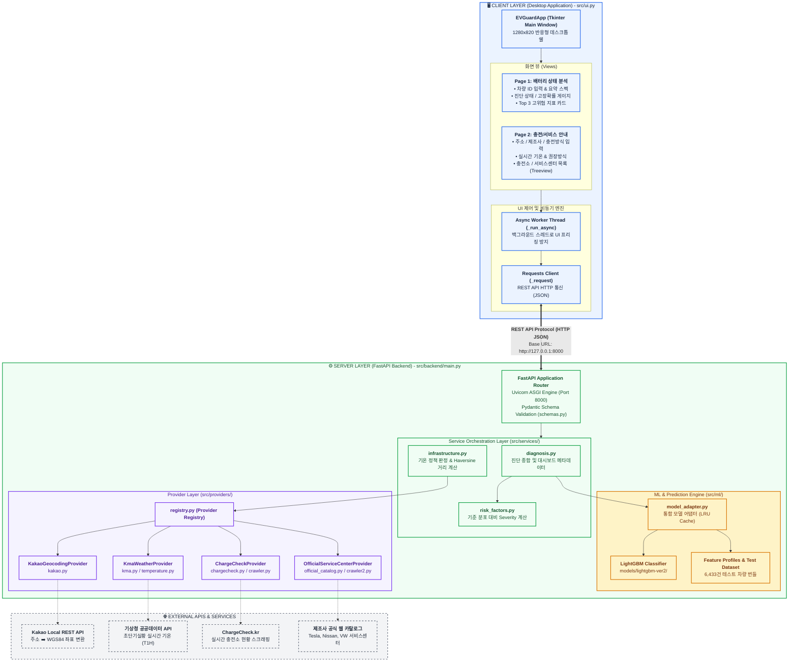
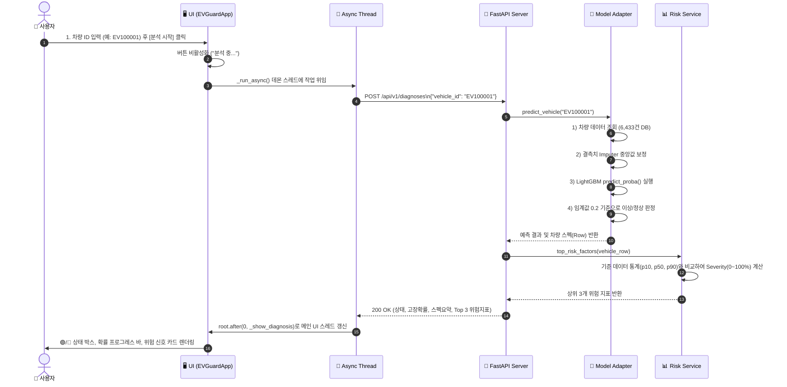
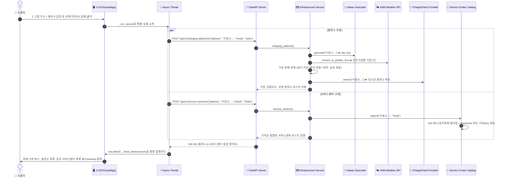

# ⚡ EV Guard 배터리 진단 및 인프라 서비스 아키텍처 & 기술 명세서

본 문서는 **EV Guard (전기차 배터리 진단 및 충전·정비 인프라 안내 서비스)**의 **Client-Server (C/S) 구조**, **데이터 통신 흐름**, 그리고 각 레이어별 **기술 스택, 엔진, 핵심 함수**를 종합 정리한 기술 문서입니다.

---

## 📑 목차
1. [시스템 전체 C/S 아키텍처 (Overview)](#1-시스템-전체-cs-아키텍처-overview)
2. [C/S 요청-응답 통신 시퀀스 (Interaction Flow)](#2-cs-요청-응답-통신-시퀀스-interaction-flow)
3. [레이어별 기술 스택 & 엔진 상세](#3-레이어별-기술-스택--엔진-상세)
4. [핵심 기능 및 주요 함수 매핑 표](#4-핵심-기능-및-주요-함수-매핑-표)

---

## 1. 시스템 전체 C/S 아키텍처 (Overview)

EV Guard는 **Tkinter 기반의 독립 데스크톱 클라이언트**와 **FastAPI 기반의 비동기 REST 백엔드 서버**로 명확히 분리된 **2-Tier 분리형 C/S 아키텍처**를 채택하고 있습니다.

---

## 2. C/S 요청-응답 통신 시퀀스 (Interaction Flow)

### 2.1 [STEP 1] 전기차 배터리 상태 분석 시퀀스

---

### 2.2 [STEP 2] 맞춤 충전소 및 공식 서비스센터 안내 시퀀스

---

## 3. 레이어별 기술 스택 & 엔진 상세

### 🏢 [Layer 1] 프론트엔드 데스크톱 클라이언트 (UI)
* **언어 & 런타임**: `Python 3.13`
* **UI 툴킷**: `tkinter`, `tkinter.ttk` (Clam 테마 기반 모던 카드 디자인)
* **동시성 처리**: `threading.Thread(daemon=True)` + `root.after()` (비동기 I/O로 메인 이벤트 루프 블로킹 방지)
* **네트워크 통신**: `requests` (REST API JSON 통신, Timeout 45초)
* **환경 변수**: `python-dotenv` (`BACKEND_BASE_URL` 연결)

### 🚀 [Layer 2] 백엔드 API 서버 (Backend Engine)
* **웹 프레임워크**: `FastAPI 0.115+`
* **ASGI 서버**: `Uvicorn 0.34+`
* **데이터 검증 & 직렬화**: `Pydantic v2` (안정적인 API 스키마 계약 보장)
* **설계 패턴**: `Provider Pattern` + `Layered Architecture` (외부 수집처가 바뀌어도 UI 계약 유지)

### 🧠 [Layer 3] 머신러닝 & 진단 엔진 (ML & Analytics)
* **분류 엔진**: `LightGBM 4.7.0` (`lgbm_battery_model.pkl`)
* **격리 학습 엔진**: `XGBoost 3.2.0` (`models/generated-xgb/`에만 생성)
* **데이터 가공/분석**: `pandas`, `numpy`, `scikit-learn 1.7.2`
* **모델 직렬화**: `joblib 1.5.3`
* **성능 최적화**: `@lru_cache`를 통한 모델 아티팩트 및 CSV 메모리 캐싱

### 🌐 [Layer 4] 외부 연동 & 크롤링 엔진 (Providers)
* **좌표 변환**: Kakao Local REST API (`https://dapi.kakao.com/v2/local/search/address.json`)
* **기상 데이터**: 기상청 초단기실황 공공데이터 Open API (LCC 투영 좌표계 변환식 탑재)
* **충전소 크롤링**: `requests` + `BeautifulSoup4` (`chargecheck.kr` HTML 파싱)
* **서비스센터 카탈로그**: 제조사 공식 사이트 파싱 + 24시간 TTL CSV 로컬 캐시 + `Selenium` Headless Fallback

---

## 4. 핵심 기능 및 주요 함수 매핑 표

| 레이어 / 단계 | 모듈 및 파일 경로 | 핵심 함수 / 클래스 | 기술 및 동작 원리 | 입력 ➡️ 출력 데이터 |
| :--- | :--- | :--- | :--- | :--- |
| **UI 화면 제어** | `src/ui.py` | `EVGuardApp` | Tkinter 윈도우 생성, 2페이지 탭 전환, 디자인 토큰 적용 | 사용자 인터랙션 ➡️ 화면 렌더링 |
| **비동기 통신** | `src/ui.py` | `_run_async()` | 데몬 스레드에서 API 호출 후 `root.after`로 메인 스레드 콜백 | 함수 포인터 ➡️ 안전한 UI 업데이트 |
| **API 엔드포인트** | `src/backend/main.py` | `vehicle_diagnosis()` `charging_stations_endpoint()` `service_centers_endpoint()` | FastAPI 라우터, HTTP 예외 핸들링, Pydantic DTO 변환 | HTTP Request ➡️ JSON Response |
| **배터리 예측** | `src/ml/model_adapter.py` | `predict_vehicle()` | 15개 피처 추출 ➡️ Imputer 결측치 보정 ➡️ LightGBM `predict_proba()` ➡️ 임계값 0.2 판정 | `vehicle_id` ➡️ 진단상태, 고장확률 |
| **모델 메타데이터** | `src/ml/model_adapter.py` | `dashboard_metadata()` | 모델의 `feature_importances_`를 0~1 정규화하여 상위 10개 피처 산출 | 모델 아티팩트 ➡️ 피처 중요도 리스트 |
| **위험 지표 산출** | `src/services/risk_factors.py` | `top_risk_factors()` | 차량의 센서 값과 기준 통계(p10, p50, p90) 간 편차 계산 (`_severity`) | 차량 데이터 ➡️ Top 3 고위험 지표 |
| **주소 좌표 변환** | `src/providers/geocoding/kakao.py` | `KakaoGeocodingProvider.geocode()` | Kakao REST API를 호출하여 지번/도로명 주소를 위도/경도로 변환 | 주소 문자열 ➡️ `Coordinates(lat, lon)` |
| **격자 변환 & 기온** | `src/apis/temperature.py` | `convert_to_grid()` `fetch_temperature()` | 위경도를 기상청 LCC 격자(nx, ny)로 투영 후 초단기실황 API에서 기온(T1H) 추출 | `(lat, lon)` ➡️ 실시간 기온 (float ℃) |
| **충전소 검색/추천** | `src/services/infrastructure.py` `src/crawlers/crawler.py` | `charging_stations()` `parse_charging_stations()` | 기온 30℃ 이상 시 완속 권장 정책 적용 + ChargeCheck 실시간 가용 충전기 수 파싱 | 주소, 모드 ➡️ 추천 충전소 목록 |
| **호환 추천 API** | `src/services/recommendations.py` | `get_recommendations()` | 기존 `/api/v1/recommendations` 응답 계약을 유지하는 추천 조합 | 위치, 모드 ➡️ 추천 충전소 목록 |
| **서비스센터 검색** | `src/providers/service_centers/official_catalog.py` | `OfficialServiceCenterProvider.search()` `_distance_km()` | 공식 카탈로그(Tesla/Nissan/VW) 24h 캐시 조회 + Haversine 구면 삼각법 거리 정렬 | 주소, 브랜드 ➡️ 거리순 정렬 센터 목록 |
